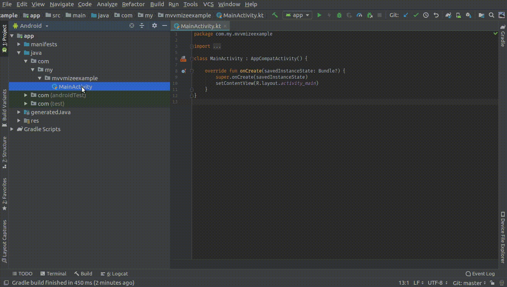

# mvvmize

A simple shell function to structure your brand new android studio kotlin project

### Demo



### Usage

Paste below function in to your `.bash_rc` file

```

function mvvmize () {

    # to hold local data source classes such as room,sqlite,realm etc.
    mkdir -p data/local && 
    
    # to hold remote data source such as Retrofit, OkHttp etc
    mkdir -p data/remote && 
    
    # to hold repository classes that will manage both local and remote data sources
    mkdir -p data/repositories && 
    
    # to hold dagger components
    mkdir -p di/components &&
    
    # to hold dagger modules
    mkdir -p di/modules &&
    
    # moving defualt `MainActivity.kt` file to new package named `ui` that'll hold all UI related classes
    mkdir -p ui/activities/main && mv MainActivity.kt ui/activities/main && 
    
    # to hold common utility packages
    mkdir utils && 
    
    # to hold common model classes
    mkdir models
}

```